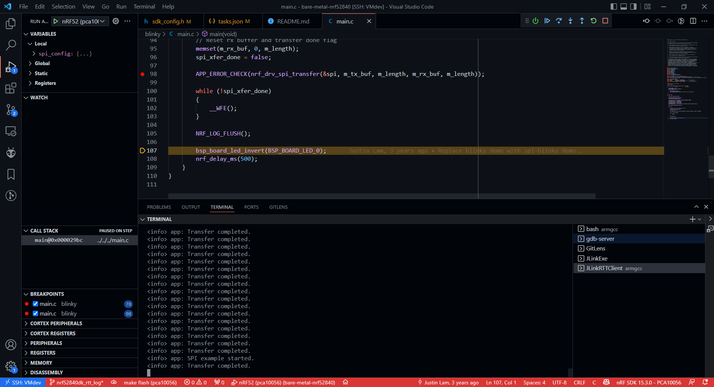

# nRF52840 Demo with Visual Studio Code

Example project to setup, flash, and debug nRF52 firmware using Visual Studio Code.

The Nordic toolchain is cross-platform, but the instructions below are specifically for Linux. However, they can easily be replicated in Windows as long as installation paths and environment variables are set correctly.

## General Comments

When using any editor + terminal for nRF52 development, the things to remember are:

- GCC path is set in `<sdk>/components/toolchain/gcc/Makefile.posix`
- Makefile is up to date with:
  - `SDK_ROOT` is pointed to where `<sdk>` is located
  - Source and header files for new components
  - Board/component configurations in `sdk_config.h`

With Visual Studio Code:

- In `.vscode/c_cpp_properties.json`, update `defines`, `includePath`, and `compilerPath` as required
- In `.vscode/launch.json`, update `executable` and `armToolchainPath` as required
- In `.vscode/tasks.json`, update the current working directory `cwd` and `command` as required (ie. changing to `make flash -j8` to use 8 cores to build).

<p align="center"><i>Screencap of Visual Studio Code using the Cortex-Debug extension.</i></p>

## Installation

### System Tools

```bash
sudo apt install build-essential

# Required by java-based CMSIS Configuration Wizard
sudo apt install default-jre
```

### Code Editor

- [Visual Studio Code](https://code.visualstudio.com/download)
  - [C/C++ Extension](https://marketplace.visualstudio.com/items?itemName=ms-vscode.cpptools) by Microsoft
  - [Cortex-Debug Extension](https://marketplace.visualstudio.com/items?itemName=marus25.cortex-debug) by marus25

### nRF52 Toolchain

#### Download

1. [nRF52 SDK](https://www.nordicsemi.com/Software-and-Tools/Software/nRF5-SDK)
2. [nRF52 Command Line Tools](https://www.nordicsemi.com/Software-and-Tools/Development-Tools/nRF5-Command-Line-Tools)
3. [Segger J-Link Software Tools](https://www.segger.com/downloads/jlink)
5. [GNU-RM Embedded Toolchain for ARM](https://developer.arm.com/tools-and-software/open-source-software/developer-tools/gnu-toolchain/gnu-rm/downloads)
    - It's recommended to install the GCC version that matches the Nordic SDK version. Check the GCC version in `<sdk>/components/toolchain/gcc/Makefile.posix` and download the appropriate version.
    - For nRF5 SDK 15.3.0, the gcc version is `gcc-arm-none-eabi-7-2018-q2-update`

Optional:

1. [Segger Ozone Debugger](https://www.segger.com/downloads/jlink/#Ozone)

#### Setup

Run the commands below to extract the archives to the respective paths.

- nRF5_SDK to `$WORKSPACE`
- nRF Command Line Tools to `/opt/` and `/usr/local/bin`
- gcc-arm-none-eabi to `/usr/local/bin`

```bash
# Unpack SDK to home directory
unzip nRF5_SDK_17.1.0_ddde560.zip -d $WORKSPACE

# Unpack nRF command line tools and make accessible in terminal
tar -xvf nRF-Command-Line-Tools_9_8_1_Linux-x86_64.tar --directory /opt/
sudo ln -s /opt/nrfjprog/nrfjprog /usr/local/bin/nrfjprog

# Install Segger
sudo apt install ./JLink_Linux_V644f_x86_64.deb

# Unpack gcc toolchain to /usr/local/bin
sudo tar -xjvf gcc-arm-none-eabi-8-2018-q4-major-linux.tar.bz2 --directory /usr/local/bin
```

If optional tools are downloaded:

Check `nrfjproj --version` that it's been installed correctly.

### Nordic SDK Setup

In the nRF52 SDK folder, update the values in `components/toolchain/gcc/Makefile.posix`:

- `GNU_INSTALL_ROOT`
- `GNU_VERSION`

This is only required if using a different gcc version than specified. It's recommended to use the same one as the SDK.

## Using the Project

### Setup

If required, update the following in `.vscode/c_cpp_properties.json`:

- Include paths
- Defines based on C/assembler flags in the Makefile

### Configuring `sdk_config.h`

[CMSIS Configuration Wizard](https://sourceforge.net/projects/cmsisconfig/) is integrated with example makefiles. In order to open sdk_config.h in this tool, type:

```
make sdk_config
```

### Build and Flash

```bash
cd application

# To just build. Optional `-jN` flag, where N is number of cores to use
make

# To build and flash
make flash

# If a SoftDevice is included in your project
make flash_softdevice
```

Build tasks can also be added to `.vscode/tasks.json`. Pressing `CTRL+SHIFT+B` will execute the default build task (in this case, the default build task is `make flash` for `PCA10056`).

### Segger UART Log

UART log backend is enabled by default (see `sdk_config.h`).

Connect to terminal using `screen /dev/ttyACM0 115200`.

### Segger RTT Log
These modification should be applied to the `sdk_config.h` file in order to enable RTT backend:
```
#define NRF_LOG_BACKEND_RTT_ENABLED 1
#define NRF_LOG_BACKEND_UART_ENABLED 0
```

To use the RTT Viewer equivalent on GNU/Linux, start by opening a terminal and starting `JLinkExe`.

Follow the steps below to connect the device (in this case, `NRF52840_XXAA`). Press ENTER to accept the default value. The only option that needs to be changed (aside from board, if necessary) is the target interface (use `SWD` instead of `JTAG`).

```
J-Link>connect
Device>
Please specify target interface:
  J) JTAG (Default)
  S) SWD
  T) cJTAG
TIF>S
Specify target interface speed [kHz]. <Default>: 4000 kHz
Speed>
Device "NRF52840_XXAA" selected.
```

Alternatively, you can specify the configurations in the command line:

```
JLinkExe -device NRF52832_XXAA -if SWD -speed 4000 -autoconnect 1
```

In another terminal, start `JLinkRTTClient`. RTT output should now start displaying. Output should be as follows:

```
###RTT Client: ************************************************************ 
###RTT Client: *               SEGGER Microcontroller GmbH                * 
###RTT Client: *   Solutions for real time microcontroller applications   * 
###RTT Client: ************************************************************ 
###RTT Client: *                                                          * 
###RTT Client: *       (c) 2012 - 2016  SEGGER Microcontroller GmbH       * 
###RTT Client: *                                                          * 
###RTT Client: *     www.segger.com     Support: support@segger.com       * 
###RTT Client: *                                                          * 
###RTT Client: ************************************************************ 
###RTT Client: *                                                          * 
###RTT Client: * SEGGER J-Link RTT Client   Compiled Apr 12 2019 17:30:19 * 
###RTT Client: *                                                          * 
###RTT Client: ************************************************************ 

###RTT Client: -----------------------------------------------
###RTT Client: Connecting to J-Link RTT Server via localhost:19021  Connected.
SEGGER J-Link V6.44f - Real time terminal output
J-Link OB-SAM3U128-V2-NordicSemi compiled Jan  7 2019 14:07:15 V1.0, SN=683903307
Process: JLinkExe
<info> app: SPI example started.
<info> app: Transfer completed.
<info> app: Transfer completed.
<info> app: Transfer completed.
...
```

### Debugging

#### Visual Studio Code

1. Open the debug pane (`CTRL+SHIFT+D`) and select **Cortex-Debug**.
2. To create a new configuration, select **Add Configuration** and choose **Cortex-Debug**.
3. If required, update the `executable` and/or `armToolchainPath` in `.vscode/launch.json`.
4. Hit `F5` to start debugging.



## Resources

- [Nordic Information Center](https://infocenter.nordicsemi.com/index.jsp) - Official Documentation
